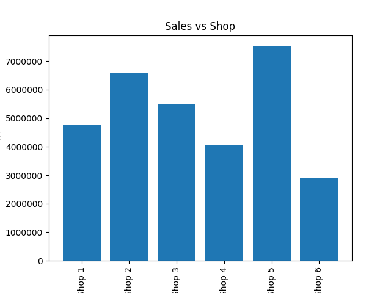
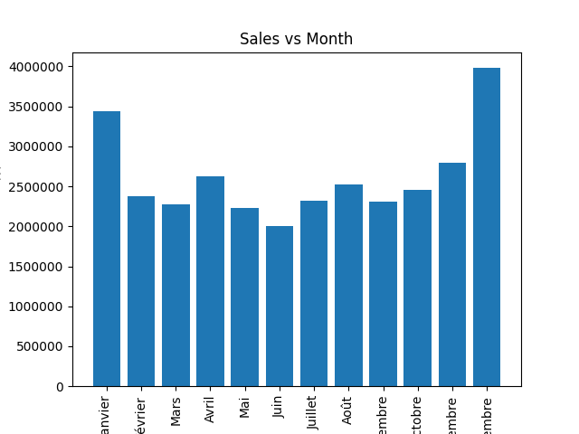
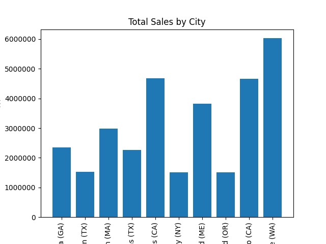
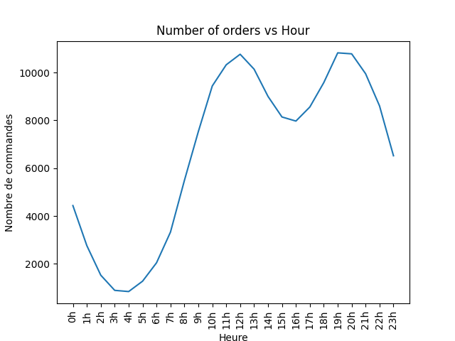

# DataMgmt - Laboratoire n°5 - Data Preprocessing

- Daniel Ribeiro Cabral

## Graph: Total Sales by Shop (salesVsshop.png)

### Question
- Quel magasin possède le prix total des ventes le plus élevé ? Quel est ce prix total ?
### Réponse
- Le magasin avec le plus de ventes est le Shop 5 avec un CA total de 7’534’453 dollars.

## Graph: Total Sales by Month (salesVsmonth.png)

### Question
- Quel mois possède le prix total des ventes le plus élevé ? Quel est ce prix total ?
### Réponse
- Le mois qui a fait le plus de ventes est décembre avec un total de 3’979’721.16 dollars.

## Graph: Total Sales by City (salesVscity.png)

### Question
- Quelle ville possède le prix total des ventes le plus élevé ? Quel est ce prix total ?
### Réponse
- La ville qui a fait le plus de ventes est Seattle (WA) avec un total de 6’027’777 dollars.

## Graph: Number of Orders vs Hour (orders_by_hour.png)

### Questions
- Quelle sont les 3 heures ayant le nombre de commandes effectuées le plus élevé ? Pour chacune de ces 3 heures, quel est le nombre de commandes effectuées ?
### Réponses
- Les heures avec le plus de ventes sont 19h (10821 commandes), 20h (10780 commandes), et 12h (10763 commandes).

## Top 10 Product Pairs Sold Together
### List
- ('Google Phone', 'USB-C Charging Cable') : 927
- ('Lightning Charging Cable', 'iPhone') : 914
- ('Wired Headphones', 'iPhone') : 415
- ('Google Phone', 'Wired Headphones') : 355
- ('Apple Airpods Headphones', 'iPhone') : 351
- ('USB-C Charging Cable', 'Vareebadd Phone') : 298
- ('Bose SoundSport Headphones', 'Google Phone') : 202
- ('USB-C Charging Cable', 'Wired Headphones') : 154
- ('Lightning Charging Cable', 'Wired Headphones') : 135
- ('Vareebadd Phone', 'Wired Headphones') : 124
